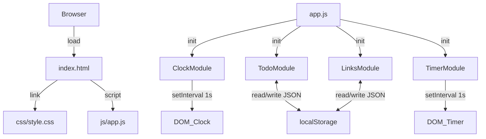

# Design Document — Life Dashboard

## Overview

Life Dashboard adalah aplikasi web *single-page* yang berjalan sepenuhnya di sisi klien (client-side only). Tidak ada server backend, tidak ada framework JavaScript, dan tidak ada proses build. Seluruh logika ditulis dalam satu file JavaScript, seluruh gaya dalam satu file CSS, dan data pengguna disimpan di `localStorage` browser.

Empat komponen utama ditampilkan sekaligus dalam satu halaman:

| Komponen | Fungsi |
|---|---|
| **Jam & Sapaan** | Menampilkan waktu, tanggal, dan sapaan real-time |
| **To-Do List** | Mengelola daftar tugas harian |
| **Focus Timer** | Hitungan mundur 25 menit untuk sesi kerja |
| **Quick Links** | Menyimpan dan membuka tautan favorit |

### Keputusan Desain Utama

- **Satu file JS, satu file CSS** — Sesuai batasan TC-4. Modul diorganisasi secara logis menggunakan pola *Immediately Invoked Function Expression* (IIFE) dan *module pattern* berbasis objek literal, bukan ES Modules (agar tidak memerlukan server HTTP untuk `import`).
- **Tidak ada framework** — Manipulasi DOM dilakukan langsung dengan `document.createElement`, `innerHTML` (hanya untuk template statis), dan event delegation.
- **localStorage sebagai satu-satunya penyimpanan** — Semua data diserialisasi ke JSON sebelum disimpan dan di-deserialisasi saat dimuat.
- **Interval-based clock** — `setInterval` dengan interval 1 detik digunakan untuk memperbarui jam dan timer.

---

## Architecture

### Struktur Folder dan File

```
Mini-Project/
├── index.html          # Satu-satunya file HTML
├── css/
│   └── style.css       # Satu-satunya file CSS
├── js/
│   └── app.js          # Satu-satunya file JavaScript
└── .kiro/
    └── specs/
        └── life-dashboard/
            ├── requirements.md
            └── design.md
```

> **Catatan:** `main.css` yang ada di root akan dipindahkan/digantikan oleh `css/style.css`. `index.html` akan diperbarui untuk merujuk ke path yang benar.

### Alur Data Tingkat Tinggi



### Pola Arsitektur

`app.js` menggunakan **Module Pattern** — setiap komponen adalah objek literal dengan metode `init()`, `render()`, dan metode-metode internal. Semua modul terdaftar dalam namespace global `LifeDashboard` untuk menghindari polusi namespace global.

```
LifeDashboard
├── Clock      — modul jam & sapaan
├── Todo       — modul to-do list
├── Timer      — modul focus timer
├── Links      — modul quick links
└── Storage    — utilitas baca/tulis localStorage
```

---

## Components and Interfaces

### HTML Layout

`index.html` menggunakan struktur semantik dengan empat `<section>` di dalam `<main>`:

```html
<!DOCTYPE html>
<html lang="id">
<head>
  <meta charset="UTF-8" />
  <meta name="viewport" content="width=device-width, initial-scale=1.0" />
  <title>Life Dashboard</title>
  <link rel="stylesheet" href="css/style.css" />
</head>
<body>
  <main class="dashboard">

    <!-- Komponen 1: Jam & Sapaan -->
    <section class="card card--clock" id="clock-section">
      <p class="clock__greeting" id="clock-greeting"></p>
      <p class="clock__time"     id="clock-time"></p>
      <p class="clock__date"     id="clock-date"></p>
    </section>

    <!-- Komponen 2: To-Do List -->
    <section class="card card--todo" id="todo-section">
      <h2 class="card__title">Tugas Hari Ini</h2>
      <div class="todo__input-row">
        <input type="text" id="todo-input" placeholder="Tambah tugas baru…" />
        <button id="todo-add-btn">Tambah</button>
      </div>
      <ul class="todo__list" id="todo-list"></ul>
    </section>

    <!-- Komponen 3: Focus Timer -->
    <section class="card card--timer" id="timer-section">
      <h2 class="card__title">Focus Timer</h2>
      <p class="timer__display" id="timer-display">25:00</p>
      <div class="timer__controls">
        <button id="timer-start-btn">Mulai</button>
        <button id="timer-stop-btn">Berhenti</button>
        <button id="timer-reset-btn">Reset</button>
      </div>
    </section>

    <!-- Komponen 4: Quick Links -->
    <section class="card card--links" id="links-section">
      <h2 class="card__title">Tautan Cepat</h2>
      <div class="links__input-row">
        <input type="text" id="links-name-input" placeholder="Nama situs…" />
        <input type="url"  id="links-url-input"  placeholder="https://…" />
        <button id="links-add-btn">Simpan</button>
      </div>
      <p class="links__error" id="links-error" hidden></p>
      <ul class="links__list" id="links-list"></ul>
    </section>

  </main>
  <script src="js/app.js"></script>
</body>
</html>
```

### CSS Architecture

`css/style.css` diorganisasi dalam lapisan berikut:

```
1. CSS Custom Properties (variabel warna, font, spacing)
2. Reset & Base Styles
3. Layout — .dashboard grid
4. Card — gaya dasar kartu bersama
5. Component: Clock
6. Component: Todo
7. Component: Timer
8. Component: Links
9. Responsive Breakpoints (tablet ≤ 1023px, mobile ≤ 767px)
```

**Grid Layout:**

```css
/* Desktop: 2×2 grid */
.dashboard {
  display: grid;
  grid-template-columns: 1fr 1fr;
  grid-template-rows: auto auto;
  gap: 1.5rem;
  padding: 2rem;
  max-width: 1200px;
  margin: 0 auto;
}

/* Tablet: 1 kolom, 4 baris */
@media (max-width: 1023px) {
  .dashboard { grid-template-columns: 1fr; }
}

/* Mobile: sama, padding lebih kecil */
@media (max-width: 767px) {
  .dashboard { padding: 1rem; gap: 1rem; }
}
```

### JavaScript Module Interfaces

#### `LifeDashboard.Storage`

Utilitas generik untuk baca/tulis `localStorage` dengan penanganan error.

```javascript
LifeDashboard.Storage = {
  get(key, fallback)   // → parsed value atau fallback jika error/tidak ada
  set(key, value)      // → void; menyimpan JSON.stringify(value)
}
```

#### `LifeDashboard.Clock`

```javascript
LifeDashboard.Clock = {
  init()               // Mulai interval 1 detik, render pertama kali
  _tick()              // Dipanggil setiap detik: update DOM jam, tanggal, sapaan
  _getGreeting(hour)   // → string sapaan berdasarkan jam (0–23)
  _formatTime(date)    // → "HH:MM:SS"
  _formatDate(date)    // → "Senin, 14 Juli 2025"
}
```

#### `LifeDashboard.Todo`

```javascript
LifeDashboard.Todo = {
  _tasks: [],          // Array of Task objects (in-memory state)
  init()               // Muat dari localStorage, render, pasang event listener
  _load()              // Baca dari Storage, isi _tasks
  _save()              // Tulis _tasks ke Storage
  _render()            // Render ulang seluruh <ul>
  _addTask(text)       // Validasi & tambah task baru → _save() → _render()
  _editTask(id, text)  // Validasi & update teks → _save() → _render()
  _toggleTask(id)      // Toggle status selesai → _save() → _render()
  _deleteTask(id)      // Hapus task → _save() → _render()
}
```

#### `LifeDashboard.Timer`

```javascript
LifeDashboard.Timer = {
  _remaining: 1500,    // detik tersisa (default 25 * 60)
  _intervalId: null,   // ID dari setInterval, null jika tidak berjalan
  init()               // Render awal, pasang event listener tombol
  _start()             // Mulai interval jika belum berjalan
  _stop()              // Hentikan interval (pause)
  _reset()             // Hentikan interval, kembalikan _remaining ke 1500
  _tick()              // Kurangi _remaining, render, cek selesai
  _render()            // Update teks #timer-display
  _notify()            // Tampilkan notifikasi sesi selesai
}
```

#### `LifeDashboard.Links`

```javascript
LifeDashboard.Links = {
  _links: [],          // Array of Link objects (in-memory state)
  init()               // Muat dari localStorage, render, pasang event listener
  _load()              // Baca dari Storage, isi _links
  _save()              // Tulis _links ke Storage
  _render()            // Render ulang seluruh <ul>
  _addLink(name, url)  // Validasi, normalisasi URL → _save() → _render()
  _deleteLink(id)      // Hapus link → _save() → _render()
  _normalizeUrl(url)   // Tambah "https://" jika tidak ada protokol
}
```

### Event Delegation

Untuk daftar tugas dan tautan, event listener dipasang pada elemen `<ul>` induk (bukan pada setiap item), menggunakan `event.target.closest('[data-id]')` untuk mengidentifikasi item yang diklik. Ini menghindari kebocoran memori akibat listener yang tidak dihapus saat item di-render ulang.

---

## Data Models

### Task Object

```javascript
{
  id:        string,   // crypto.randomUUID() atau Date.now().toString()
  text:      string,   // Teks deskripsi tugas (tidak boleh kosong/hanya spasi)
  completed: boolean,  // false = aktif, true = selesai
  createdAt: number    // timestamp Unix (ms) saat tugas dibuat
}
```

### Link Object

```javascript
{
  id:   string,  // crypto.randomUUID() atau Date.now().toString()
  name: string,  // Nama tampilan (tidak boleh kosong)
  url:  string   // URL lengkap dengan protokol (selalu diawali http:// atau https://)
}
```

### localStorage Schema

| Key | Tipe Nilai | Deskripsi |
|---|---|---|
| `lifedash_tasks` | `Task[]` (JSON) | Array semua objek tugas |
| `lifedash_links` | `Link[]` (JSON) | Array semua objek tautan |

Contoh nilai tersimpan:

```json
// lifedash_tasks
[
  { "id": "1720958400000", "text": "Belajar desain sistem", "completed": false, "createdAt": 1720958400000 },
  { "id": "1720958500000", "text": "Olahraga pagi", "completed": true, "createdAt": 1720958500000 }
]

// lifedash_links
[
  { "id": "1720958600000", "name": "GitHub", "url": "https://github.com" },
  { "id": "1720958700000", "name": "MDN Docs", "url": "https://developer.mozilla.org" }
]
```

---

## Correctness Properties

*Sebuah properti adalah karakteristik atau perilaku yang harus berlaku di semua eksekusi sistem yang valid — pada dasarnya, pernyataan formal tentang apa yang seharusnya dilakukan sistem. Properti berfungsi sebagai jembatan antara spesifikasi yang dapat dibaca manusia dan jaminan kebenaran yang dapat diverifikasi secara otomatis.*


### Property 1: Format Waktu HH:MM:SS

*Untuk semua* objek `Date` yang valid, fungsi `_formatTime` harus menghasilkan string dengan format tepat dua digit jam, dua digit menit, dan dua digit detik yang dipisahkan oleh titik dua (HH:MM:SS), termasuk zero-padding untuk nilai di bawah 10.

**Validates: Requirements 1.1**

---

### Property 2: Format Tanggal Bahasa Indonesia

*Untuk semua* objek `Date` yang valid, fungsi `_formatDate` harus menghasilkan string yang mengandung nama hari dalam bahasa Indonesia, angka tanggal, nama bulan dalam bahasa Indonesia, dan tahun empat digit.

**Validates: Requirements 1.2**

---

### Property 3: Sapaan Sesuai Rentang Jam

*Untuk semua* nilai jam (integer 0–23), fungsi `_getGreeting` harus mengembalikan tepat satu dari tiga sapaan berikut sesuai rentangnya: "Selamat Pagi" untuk jam 5–11, "Selamat Siang" untuk jam 12–17, dan "Selamat Malam" untuk jam 18–23 dan 0–4. Tidak ada nilai jam yang valid yang boleh menghasilkan sapaan di luar ketiga pilihan tersebut.

**Validates: Requirements 1.5, 1.6, 1.7**

---

### Property 4: Penambahan Tugas Valid Menambah Daftar

*Untuk semua* daftar tugas yang ada dan semua string deskripsi yang valid (tidak kosong, tidak hanya spasi), memanggil `_addTask` harus menghasilkan daftar yang panjangnya bertambah tepat satu, dan tugas baru tersebut harus memiliki teks yang sama dengan input serta status `completed: false`.

**Validates: Requirements 2.2**

---

### Property 5: Input Whitespace-Only Ditolak

*Untuk semua* string yang hanya terdiri dari karakter whitespace (termasuk string kosong), memanggil `_addTask` atau `_editTask` dengan string tersebut harus ditolak — daftar tugas tidak boleh berubah dan teks tugas yang ada tidak boleh dimodifikasi.

**Validates: Requirements 2.3, 2.5**

---

### Property 6: Toggle Status Tugas

*Untuk semua* tugas yang ada dalam daftar, memanggil `_toggleTask` harus membalik nilai `completed` — tugas aktif (`completed: false`) menjadi selesai (`completed: true`), dan tugas selesai menjadi aktif kembali. Properti lain dari tugas (id, text, createdAt) tidak boleh berubah.

**Validates: Requirements 2.6**

---

### Property 7: Penghapusan Tugas Permanen

*Untuk semua* daftar tugas yang berisi setidaknya satu tugas, memanggil `_deleteTask` dengan id tugas yang ada harus menghasilkan daftar yang tidak lagi mengandung tugas dengan id tersebut, dan panjang daftar berkurang tepat satu.

**Validates: Requirements 2.7**

---

### Property 8: Round-Trip Persistensi Tugas

*Untuk semua* array tugas yang valid, setelah operasi mutasi apapun (`_addTask`, `_editTask`, `_toggleTask`, `_deleteTask`), nilai yang tersimpan di `localStorage` dengan kunci `lifedash_tasks` harus identik dengan state in-memory `_tasks` saat itu. Selanjutnya, memanggil `_load()` pada state kosong harus memulihkan array yang sama persis.

**Validates: Requirements 2.8, 2.9, 6.1, 6.2**

---

### Property 9: Penambahan Tautan Valid Menambah Daftar

*Untuk semua* pasangan nama dan URL yang valid (keduanya tidak kosong), memanggil `_addLink` harus menghasilkan daftar tautan yang panjangnya bertambah tepat satu, dan tautan baru tersebut harus memiliki nama dan URL yang sesuai dengan input.

**Validates: Requirements 4.2**

---

### Property 10: Validasi Input Tautan Kosong

*Untuk semua* kombinasi input di mana nama kosong, URL kosong, atau keduanya kosong, memanggil `_addLink` harus ditolak — daftar tautan tidak boleh berubah.

**Validates: Requirements 4.3**

---

### Property 11: Normalisasi URL Otomatis

*Untuk semua* string URL yang tidak diawali dengan `http://` atau `https://`, fungsi `_normalizeUrl` harus mengembalikan string yang diawali dengan `https://` diikuti oleh URL asli. URL yang sudah memiliki protokol `http://` atau `https://` tidak boleh dimodifikasi.

**Validates: Requirements 4.4**

---

### Property 12: Penghapusan Tautan Permanen

*Untuk semua* daftar tautan yang berisi setidaknya satu tautan, memanggil `_deleteLink` dengan id tautan yang ada harus menghasilkan daftar yang tidak lagi mengandung tautan dengan id tersebut, dan panjang daftar berkurang tepat satu.

**Validates: Requirements 4.6**

---

### Property 13: Round-Trip Persistensi Tautan

*Untuk semua* array tautan yang valid, setelah operasi mutasi apapun (`_addLink`, `_deleteLink`), nilai yang tersimpan di `localStorage` dengan kunci `lifedash_links` harus identik dengan state in-memory `_links` saat itu. Selanjutnya, memanggil `_load()` pada state kosong harus memulihkan array yang sama persis.

**Validates: Requirements 4.7, 4.8, 6.1, 6.2**

---

### Property 14: Ketahanan Terhadap Data localStorage Rusak

*Untuk semua* string yang bukan JSON valid (termasuk string acak, JSON terpotong, atau nilai null/undefined), memanggil `Storage.get(key, fallback)` tidak boleh melempar exception dan harus mengembalikan nilai `fallback` yang diberikan.

**Validates: Requirements 6.3**

---

## Error Handling

### Strategi Penanganan Error

| Skenario | Penanganan |
|---|---|
| `localStorage` tidak tersedia (mode privat/kuota penuh) | `Storage.set()` membungkus operasi dalam `try/catch`; kegagalan diabaikan secara diam-diam |
| Data `localStorage` rusak (bukan JSON valid) | `Storage.get()` mengembalikan `fallback` dari `try/catch` di sekitar `JSON.parse()` |
| Input tugas kosong/whitespace | `_addTask` dan `_editTask` melakukan `trim()` lalu cek panjang; tolak jika 0 |
| Input tautan kosong | `_addLink` cek `name.trim()` dan `url.trim()`; tampilkan pesan error di `#links-error` |
| URL tanpa protokol | `_normalizeUrl` menambahkan `https://` secara otomatis sebelum menyimpan |
| Timer sudah berjalan saat `_start()` dipanggil | Cek `_intervalId !== null`; abaikan panggilan duplikat |
| `crypto.randomUUID()` tidak tersedia | Fallback ke `Date.now().toString() + Math.random().toString(36).slice(2)` |

### Prinsip Error Handling

- **Tidak ada pesan error teknis** yang ditampilkan kepada pengguna (tidak ada stack trace, tidak ada alert dengan pesan internal).
- **Gagal dengan anggun** — jika data tidak bisa dimuat, mulai dengan state kosong.
- **Validasi di sisi input** — tolak data tidak valid sebelum menyentuh state atau storage.

---

## Testing Strategy

### Pendekatan Pengujian Ganda

Pengujian menggunakan dua pendekatan yang saling melengkapi:

1. **Unit Tests (Example-Based)** — Menguji perilaku spesifik dengan contoh konkret: inisialisasi komponen, nilai default, interaksi tombol, dan kondisi batas.
2. **Property-Based Tests (PBT)** — Menguji properti universal yang harus berlaku untuk semua input yang valid, menggunakan library PBT untuk menghasilkan ratusan kasus uji secara otomatis.

### Library Property-Based Testing

Karena proyek ini menggunakan Vanilla JavaScript tanpa build system, library PBT yang direkomendasikan adalah **[fast-check](https://fast-check.dev/)** yang dapat dimuat via CDN dalam file test HTML terpisah, atau digunakan dengan Node.js + jsdom untuk pengujian headless.

```javascript
// Contoh konfigurasi fast-check
fc.assert(
  fc.property(fc.integer({ min: 5, max: 11 }), (hour) => {
    return LifeDashboard.Clock._getGreeting(hour) === 'Selamat Pagi';
  }),
  { numRuns: 100 } // minimum 100 iterasi per properti
);
```

### Pemetaan Properti ke Test

Setiap properti dalam dokumen ini diimplementasikan sebagai **satu** property-based test dengan tag referensi:

```javascript
// Tag format: Feature: life-dashboard, Property {N}: {deskripsi singkat}
// Feature: life-dashboard, Property 3: Sapaan sesuai rentang jam
fc.assert(
  fc.property(
    fc.oneof(
      fc.integer({ min: 5, max: 11 }),   // Pagi
      fc.integer({ min: 12, max: 17 }),  // Siang
      fc.integer({ min: 18, max: 23 }),  // Malam (malam hari)
      fc.integer({ min: 0, max: 4 })     // Malam (dini hari)
    ),
    (hour) => {
      const greeting = LifeDashboard.Clock._getGreeting(hour);
      if (hour >= 5 && hour <= 11) return greeting === 'Selamat Pagi';
      if (hour >= 12 && hour <= 17) return greeting === 'Selamat Siang';
      return greeting === 'Selamat Malam';
    }
  ),
  { numRuns: 100 }
);
```

### Cakupan Unit Tests

Unit tests (example-based) mencakup:

- **Inisialisasi**: Semua modul `init()` berjalan tanpa error, elemen DOM yang diperlukan ada
- **Nilai Default**: Timer dimulai dari 25:00, daftar tugas dan tautan kosong saat localStorage kosong
- **Interaksi Tombol**: Start/Stop/Reset timer, tombol tambah tugas, tombol simpan tautan
- **Kondisi Batas**: Timer mencapai 00:00 memicu notifikasi, `_remaining` tidak pernah negatif
- **Integrasi DOM**: Setelah `_render()`, jumlah elemen `<li>` sesuai dengan panjang array state

### Catatan Pengujian

- **PBT tidak digunakan** untuk pengujian rendering CSS/visual (Requirement 5.2, 5.3) — gunakan inspeksi visual manual.
- **PBT tidak digunakan** untuk pengujian perilaku `setInterval` secara langsung — gunakan spy/mock dalam unit test.
- Setiap property test dikonfigurasi dengan **minimum 100 iterasi** (`numRuns: 100`).
- Fungsi-fungsi murni (`_formatTime`, `_formatDate`, `_getGreeting`, `_normalizeUrl`) adalah kandidat terbaik untuk PBT karena tidak memiliki efek samping.
